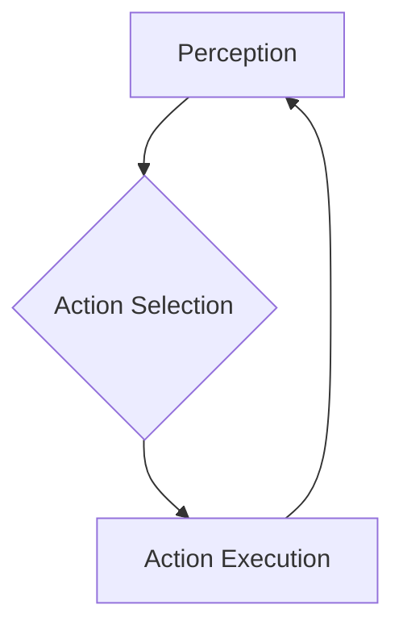

## Learning Objectives

- Comprehend the concept of embodied intelligence.
- Understand the advantages of physical embodiment for AI.

## Overview

This chapter explores the theory and implications of embodied intelligence, where AI systems learn and interact through a physical body.

## Main Content

Embodied intelligence is a paradigm in AI and robotics that posits intelligence emerges from the interaction of an agent's physical body with its environment. Unlike disembodied AI, which operates purely in a digital realm (e.g., chess programs, large language models), embodied AI emphasizes the inseparable link between perception, action, and cognition within a physical substrate.

### The Importance of Embodiment

1.  **Direct Interaction with the Physical World**: An embodied agent can directly manipulate objects, navigate spaces, and experience the world through its sensors. This provides rich, multimodal data that is fundamentally different from symbolic inputs or large static datasets.
2.  **Grounding of Concepts**: Abstract concepts can be 'grounded' in physical experience. For example, a robot learns the meaning of 'push' or 'lift' by physically performing these actions and observing their consequences.
3.  **Sensorimotor Loop**: Embodied intelligence thrives on the sensorimotor loop, where actions influence perception, and perceptions inform subsequent actions. This continuous feedback cycle is crucial for learning adaptive behaviors and developing robust models of the world.

4.  **Learning and Adaptation**: Robots with bodies can experiment, make mistakes, and learn from the physical consequences of their actions. This hands-on learning is often more efficient and robust than learning purely through simulation or abstract reasoning for physical tasks.
5.  **Dealing with Uncertainty and Novelty**: The real world is inherently messy and unpredictable. Embodied agents are designed to cope with sensor noise, unexpected obstacles, and novel situations by continually adjusting their behavior through physical interaction.

### Situated Cognition

Closely related to embodied intelligence is the concept of **situated cognition**, which suggests that knowledge and cognitive processes are not abstract and universal but are tied to the specific contexts and situations in which they occur. For a robot, its cognitive processes are situated within its physical body, its current environment, and its immediate task.

### Challenges in Embodied AI

*   **The Moravec Paradox**: What is easy for humans (e.g., walking, grasping) is incredibly hard for robots, while what is hard for humans (e.g., complex calculations) is easy for computers. This highlights the difficulty in replicating robust sensorimotor skills.
*   **Hardware Limitations**: The capabilities of embodied AI are constrained by the robot's physical form, its sensors, actuators, power, and computational resources.
*   **Sim-to-Real Gap**: Behaviors learned in simulation often do not transfer perfectly to the real world due to differences in physics, sensor noise, and environmental fidelity.

## Summary

Embodied intelligence highlights that true intelligence for physical agents emerges from continuous interaction between a robot's body and its environment. It emphasizes direct physical interaction, grounding of concepts, and the critical role of the sensorimotor loop in learning and adaptation. Concepts like situated cognition further reinforce that a robot's intelligence is deeply tied to its physical context. Despite challenges such as the Moravec Paradox and the sim-to-real gap, embodied AI remains a crucial research area for developing robots capable of robust and adaptive behavior in the complex physical world.

## Key Terms

- Embodiment
- Sensorimotor Loop
- Situated AI

## Review Questions

1. What defines an embodied intelligent system?
2. Discuss the benefits of physical embodiment for AI development.