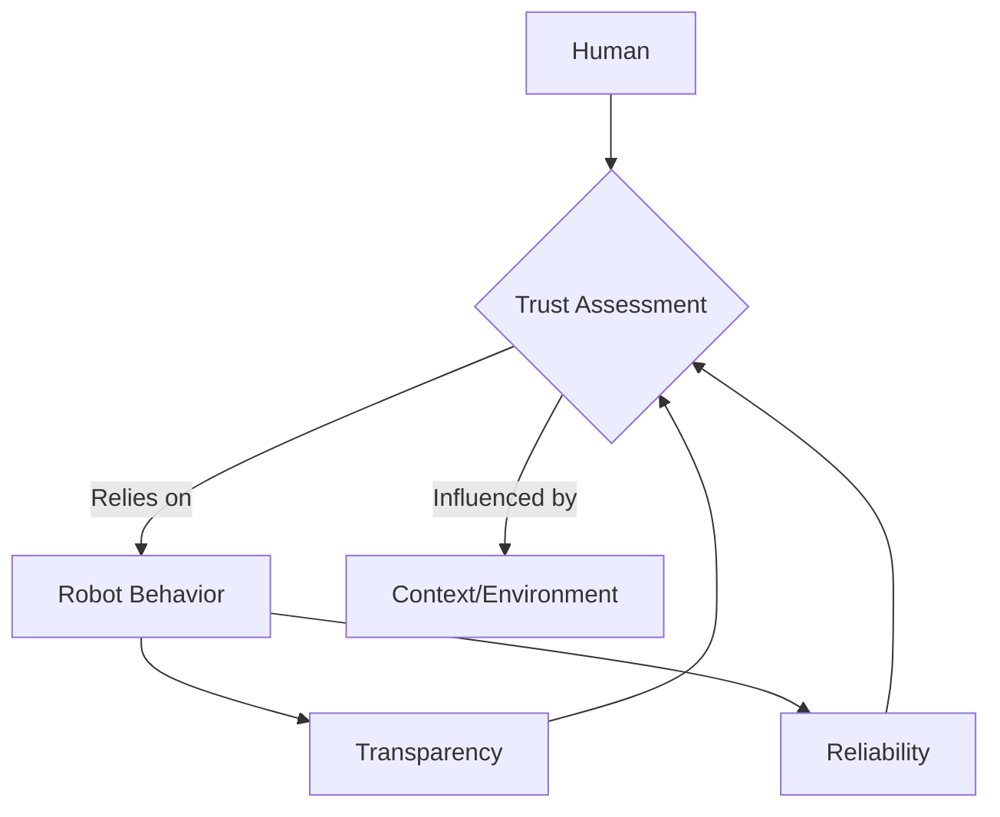

## Learning Objectives

- Understand the principles of effective human-robot interaction.
- Explore different modalities and challenges in HRI.

## Overview

This chapter examines the crucial field of Human-Robot Interaction, focusing on how humans and robots can communicate and collaborate safely and intuitively.

## Main Content

Human-Robot Interaction (HRI) is a multidisciplinary field concerned with the design, implementation, and evaluation of robotic systems that interact with humans. The goal is to create robots that can safely, effectively, and intuitively collaborate with people, enhancing human capabilities and improving quality of life.

### Principles of Effective HRI
Key principles for effective HRI include:

-   **Safety:** Ensuring robots operate without causing harm to humans. This involves collision avoidance, safe motion planning, and robust emergency stop mechanisms.
-   **Trust:** Building human confidence in robot reliability and intent. Trust is crucial for effective collaboration and acceptance.
-   **Communication:** Enabling clear and natural exchange of information between humans and robots. This can involve verbal commands, gestures, visual cues, and haptic feedback.
-   **Adaptability:** Robots should be able to adapt to human behavior, preferences, and varying environmental conditions.
-   **Teamwork:** Designing robots to function as effective teammates, understanding human roles and contributing appropriately to shared goals.

### HRI Modalities
Interaction can occur through various modalities:

-   **Physical Interaction:** Direct contact between humans and robots, common in collaborative robotics (cobots). Requires compliant control and force sensing.
-   **Verbal Communication:** Speech recognition and synthesis for natural language interaction.
-   **Non-Verbal Communication:** Gestures, facial expressions (for expressive robots), gaze tracking, and body language.
-   **Haptic Feedback:** Touch-based communication, often used in teleoperation or for conveying robot state.
-   **Visual Displays:** Screens or projections on robots to convey information, status, or intent.

### Challenges in HRI
Despite advancements, several challenges persist:
-   **Predictability and Transparency:** Humans need to understand robot intentions and predict their actions. Lack of transparency can erode trust.
-   **Cultural and Social Norms:** Robots must navigate diverse cultural expectations and social conventions, which vary significantly across populations.
-   **Ethical Considerations:** Addressing issues of responsibility, accountability, privacy, and the potential impact of robots on employment and human relationships.
-   **Learning from Humans:** Developing robots that can robustly learn new skills and adapt their behavior from human demonstrations or feedback.
-   **Long-term Interaction:** Maintaining effective HRI over extended periods, accounting for changes in human expectations and robot capabilities.

## Summary

Human-Robot Interaction (HRI) is vital for integrating robots into human environments. It focuses on safety, trust, communication, adaptability, and teamwork. Modalities range from physical contact to verbal and non-verbal cues. Challenges include ensuring predictability, navigating cultural norms, addressing ethical concerns, enabling robust learning from humans, and sustaining effective long-term interactions. Effective HRI aims to create robots that seamlessly enhance human capabilities and coexist intuitively.

## Key Terms

- HRI Modalities
- Shared Autonomy
- Trust in Robotics
- Social Robotics

## Review Questions

1. What are the key challenges in achieving natural human-robot communication?
2. Discuss the concept of shared autonomy in HRI.