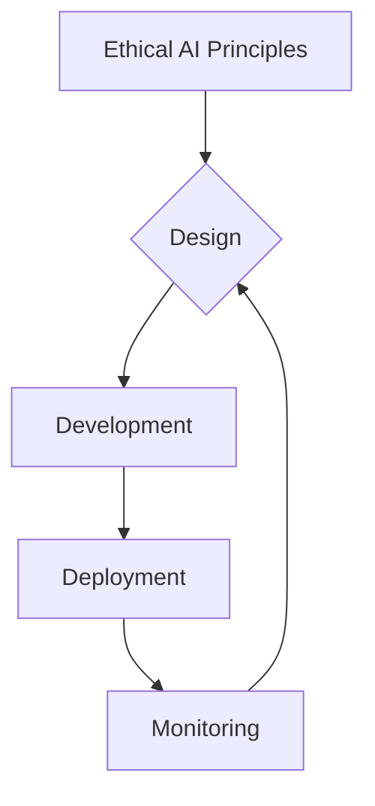

## Learning Objectives

- Analyze the broader societal and ethical implications of widespread physical AI and humanoid robotics.
- Evaluate frameworks for responsible development and deployment.

## Overview

This chapter explores the profound societal and ethical considerations surrounding the advancement and integration of physical AI and humanoid robotics into daily life.

## Main Content

The integration of physical AI and humanoid robotics into society presents profound ethical and societal considerations. As these technologies become more capable and ubiquitous, it is crucial to proactively address their potential impacts on employment, privacy, human dignity, and bias.

### Economic Impact and Job Displacement
One of the most significant concerns is the potential for widespread job displacement as robots automate tasks currently performed by humans. While automation can increase productivity and create new types of jobs, the transition can be disruptive.
-   **Automation of Routine Tasks:** Robots are increasingly performing repetitive, dangerous, or physically demanding jobs in manufacturing, logistics, and service sectors.
-   **New Job Creation:** The robotics industry itself creates jobs in development, maintenance, and oversight. However, these new roles often require different skill sets.
-   **Mitigation Strategies:** Implementing policies such as retraining programs, universal basic income (UBI) discussions, and fostering human-robot collaboration to create symbiotic work environments.

### Ethical AI and Algorithmic Bias
AI systems, including those powering humanoid robots, can perpetuate or even amplify existing societal biases if not carefully designed and trained. This can lead to unfair or discriminatory outcomes.
-   **Data Bias:** Training data reflecting human biases can result in robots exhibiting biased behavior or decision-making.
-   **Fairness and Accountability:** Ensuring that robotic systems are fair, transparent, and that there are clear lines of accountability when errors or harm occur.
-   **Prevention Strategies:** Diverse and representative training datasets, rigorous auditing of AI algorithms, and incorporating ethical guidelines into the development lifecycle.

### Privacy and Surveillance
Humanoid robots equipped with advanced sensors (cameras, microphones) raise concerns about privacy, data collection, and potential surveillance, especially in public or private spaces.
-   **Data Collection:** Robots can collect vast amounts of personal data, which needs to be managed securely and ethically.
-   **Surveillance Risks:** The potential for robots to be used for unauthorized monitoring or tracking.
-   **Safeguards:** Implementing robust data protection regulations (e.g., GDPR), anonymization techniques, and clear communication about data collection practices.

### Human Dignity and Autonomy
The increasing sophistication of humanoid robots can blur the lines between human and machine, leading to philosophical debates about human dignity, autonomy, and the nature of social interaction.
-   **Emotional Connection:** Humans can form emotional bonds with robots, raising questions about manipulation and the authenticity of such relationships.
-   **Robot Rights:** As robots become more intelligent, questions may arise regarding their status, rights, and responsibilities.
-   **Impact on Social Skills:** Over-reliance on robot companions could potentially diminish human social interaction skills.

### Responsible Development and Governance
Developing a robust framework for the ethical design, deployment, and governance of physical AI and humanoid robotics is essential to maximize benefits and mitigate risks.

-   **Ethical Guidelines:** Establishing clear ethical principles and codes of conduct for researchers, developers, and manufacturers.
-   **Regulation and Policy:** Developing appropriate laws and regulations to address safety, liability, data privacy, and societal impact.
-   **Public Engagement:** Fostering public dialogue and education to build trust and ensure societal values are reflected in technological advancements.

## Summary

The widespread integration of physical AI and humanoid robotics raises significant ethical and societal issues, including job displacement, algorithmic bias, privacy concerns, and impacts on human dignity. Mitigating these challenges requires proactive strategies such as retraining programs, robust data protection, fair AI design, and comprehensive ethical governance frameworks. Responsible development and public engagement are crucial for maximizing the benefits of these technologies while safeguarding human values.

## Key Terms

- AI Ethics
- Robot Rights
- Job Displacement
- Algorithmic Bias
- Responsible AI

## Review Questions

1. Discuss the ethical considerations related to job displacement due to advanced humanoid robotics. What mitigation strategies can be proposed?
2. How can algorithmic bias in AI systems be prevented when designing and deploying humanoid robots?